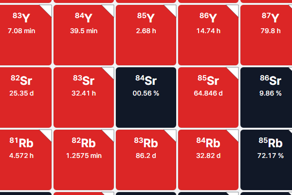

# NUBASE2020 원문 오기와 앱 표시

검증일: 2026-10-02. 앱은 NUBASE2020 원문을 정확히 옮긴다(02 문서: 318건 모두 일치). 그래서 **원문에 있는 오기도 화면에 그대로 나온다.** 이 문서는 원문 자체의 오기로 판단한 12건과 앱 자체의 표시 결함 1건을 정리한다. 수정은 하지 않았다.

## TOP 5

| 심각도 | 관점 | 문제 | 근거 |
| --- | --- | --- | --- |
| 치명 | [교육][방사화학][감마분광] | ¹⁶⁴Ho의 β⁻ 39 % 분기가 `β+ 39 %`로 표시되어 ¹⁶⁴Er로 가는 경로가 화면에서 사라짐 | [확인됨: [UI](evidence/flags/ui/ui-Ho-164.png), Q값, ENSDF, NUBASE2016] |
| 치명 | [교육][방사화학] | ¹⁸²Pt의 EC+β⁺ 99.962 %가 `β+ 0.962 %`로 표시 (분기 합 1 %) | [확인됨: [UI](evidence/flags/ui/ui-Pt-182.txt), ENSDF, NUBASE2016] |
| 높음 | [교육][방사화학] | ¹⁵¹Ho의 EC+β⁺ 78 %가 `β+ 88 %`로 표시 (분기 합 110 %) | [확인됨: [UI](evidence/flags/ui/ui-Ho-151.txt), ENSDF] |
| 중간 | [질량분석] | ²⁸Si·³⁰Si 존재비 불확도가 10배 작게, ³²S는 10배 크게 표시 | [확인됨: CIAAW 구간 환산, [UI](evidence/flags/ui/ui-S-32.txt)] |
| 중간 | [핵물리][방사화학] | ¹¹⁵Rh `1.03 ± 3 s`, ¹⁸⁷Ta `2.3 ± 6 min` 등 반감기 불확도 자릿수 오류 | [확인됨: NUBASE 주석·원 논문 표기] |

## 1. 찾은 방법

| 방법 | 범위 | 찾은 항목 | 스크립트·결과 |
| --- | --- | --- | --- |
| 318건 원인 분류 | 치명·높음 플래그 | ¹⁶⁴Ho, ¹⁸²Pt, ¹⁵¹Ho, ¹³⁸Cs | [classify_flags.py](evidence/flags/classify_flags.py) |
| 내부 일관성 선별 | NUBASE 전체 상태 | ¹⁶⁴Ho, ¹⁸²Pt, ¹⁵¹Ho, ²¹⁷Pa | [nubase_consistency.py](evidence/flags/nubase_consistency.py) → [결과](evidence/flags/nubase2020-consistency.json) |
| CIAAW 존재비 전수 비교 | 존재비 289개 | ²⁸Si, ³⁰Si, ³²S | [ciaaw_compare.py](evidence/golden/ciaaw_compare.py) → [결과](evidence/golden/ciaaw-vs-app.json) |
| 표기 이상 선별 | NUBASE 전체 | ¹¹⁵Rh, ¹⁸⁷Ta, ⁸⁶Ge, ¹²¹Inⁿ, ⁸⁴Sr | [nubase_format_scan.py](evidence/flags/nubase_format_scan.py) → [결과](evidence/flags/nubase2020-format-scan.json) |

내부 일관성 선별은 (1) 주 붕괴 분기가 모두 `=` 값일 때 합이 100 %에서 1 %p 넘게 벗어나는 상태, (2) 바닥상태에서 표시된 모드가 AME2020 Q값으로 금지되는 경우(β⁻인데 Qβ⁻<0, β⁺인데 QEC<0, e⁺인데 QEC<1022 keV, α인데 Qα<0), (3) NUBASE 표기상 β⁺(EC+e⁺ 합계)가 그 내역인 EC보다 작은 경우를 찾는다. 합계 이상 5건 중 ⁵⁴Zn(두 측정의 평균 87(7) %)과 ¹⁵⁷Hf(ENSDF도 α 94 % + EC+β⁺ 14 %로 같음)는 오기가 아니다.

NUBASE2016 원문과 대조하면 ¹⁸⁷Ta(2016판도 `2.3 m 6`)를 뺀 11건과 ⁸⁴Sr의 선행 0은 모두 2020판에서 처음 생긴 값·표기다. 예: ¹¹⁵Rh는 2016판 `990 ms 50`, ⁸⁴Sr은 `IS=0.56 1`이었다.

각 항목의 원문 행·NUBASE2016 행·LiveChart 행·앱 표시는 [source-errata-evidence.json](evidence/flags/source-errata-evidence.json)에 모았다(분기·반감기 5개 핵종). 나머지는 위 선별 결과 파일에 있다. 실제 앱 화면은 [ui/](evidence/flags/ui/)에 텍스트와 PNG로 저장했다.

## 2. 붕괴 분기 오기

### ¹⁶⁴Ho [치명][교육][방사화학][감마분광]

- 앱 화면: `EC 61 ± 1 % → 164Dy`, `β+ 39 ± 1 % → 164Dy`.
- 원문: `EC=61 1;B+=39 1`. 논문 Table I도 같다. NUBASE2016은 `EC=60 5;B-=40 5`였다.
- ENSDF (LiveChart, 2017-11, Singh & Chen): EC+β⁺ 60(5) %, **β⁻ 40(5) %**.
- 물리: 앱이 보여 주는 AME2020 값으로 QEC = 987.1 ± 1.4 keV < 1022 keV라 양전자 방출이 불가능하고, Qβ⁻ = 962.1 ± 1.4 keV라 β⁻는 가능하다. NUBASE 표기에서 β⁺는 EC+e⁺ 합계인데 합계(39)가 내역(EC 61)보다 작다. 어느 해석으로도 원문 행은 성립하지 않는다.
- 판단: 2020판에서 `B-`가 `B+`로 잘못 적혔다. [확인됨]
- 영향: ¹⁶⁴Ho가 ¹⁶⁴Dy와 ¹⁶⁴Er 사이에서 양쪽으로 붕괴하는 대표 교육 사례인데, 앱은 모든 붕괴가 ¹⁶⁴Dy로 간다고 보여 준다.

### ¹⁸²Pt [치명][교육][방사화학]

- 앱 화면: `β+ 0.962 ± 0.002 % → 182Ir`, `α 0.038 ± 0.002 % → 178Os`. 분기 합 1 %.
- 원문: `B+=0.962 2;A=0.038 2`. NUBASE2016은 `B+~100;A=0.038 2`.
- ENSDF (2015-07): EC+β⁺ 99.962(2) %, α 0.038(2) %.
- 판단: 앞자리 `99.`가 빠졌다. 불확도 `2`(=0.002)까지 ENSDF와 같다. [확인됨]

### ¹⁵¹Ho [높음][교육][방사화학]

- 앱 화면: `β+ 88 ± 3 %`, `α 22 ± 3 %`. 분기 합 110 %.
- 원문: `B+=88 3;A=22 3`. NUBASE2016은 `B+=?;A=22 3`.
- ENSDF (2008-11): EC+β⁺ 78(3) %, α 22(3) %.
- 판단: 78을 88로 잘못 적었다. 두 분기는 서로 보완 관계라 합이 정확히 100이어야 한다. [확인됨]
- 심각도를 높음으로 둔 이유: 대표 모드와 딸핵종은 맞고 10 %p 차이다.

### ²¹⁷Pa [낮음][핵물리]

- 앱 화면: `β− ? → 217U`.
- 원문: `A=100;B- ?` (`?` = 에너지상 가능하나 미관측). NUBASE2016은 `A=100;B=0.0024#`.
- AME2020: Qβ⁻ = −5,916 keV. ²¹⁷Pa는 양성자 과잉 핵이라 β⁻가 불가능하고, ²¹⁷U로 가는 딸 링크도 성립하지 않는다.
- 판단: β⁺(EC)를 β⁻로 적은 것으로 추정한다. 미관측 모드라 영향은 작다. [추정: 의도한 기호]

## 3. 반감기 값 오기 (확신 중간)

### ¹³⁸Cs [중간][감마분광][방사화학]

- 앱 화면: `33.5 ± 0.2 min`.
- 원문: `33.5 m 0.2`. NUBASE 자체 참조·주석이 없고 ENSDF 연도는 17이다. 즉 2017 ENSDF를 그대로 쓴 행이다.
- ENSDF 2017 (Chen) 채택값: **32.5(2) min**. 측정 7개(33.1, 33.41, 32.2, 32.1, 32.33, 32.2, 32.1 min)의 비가중 평균 32.49 min이다. [NNDC 문서](evidence/flags/nndc/138cs_adopted.html)
- NUBASE2016은 2003 ENSDF 기반 33.41(18) min이었다.
- 판단: 2017 값을 옮기며 32.5를 33.5로 잘못 적었을 가능성이 높다. 어떤 평균으로도 33.5가 나오지 않는다. 다만 NUBASE가 별도로 재평가했을 가능성을 완전히 배제할 근거는 없어 확신은 중간이다.

## 4. 불확도 자릿수 오류

NUBASE 원문의 두 열은 불확도 표기 규칙이 다르다.

- 반감기 열: 값과 같은 단위의 **절대 불확도** (`12.32 y 0.02`, `2.01 s 0.08`).
- 붕괴·존재비 열: **마지막 자리 단위**의 ENSDF식 (`25.9 23` = 25.9 ± 2.3, NUBASE2020 Table I 설명).

앱은 두 규칙을 정확히 따른다. 아래 행은 원문이 자기 규칙을 어겨 앱 표시가 틀어졌다. 앱 표시 열은 실제 패널에서 읽은 값이다([ui/](evidence/flags/ui/)의 `ui-Rh-115`, `ui-Ta-187`, `ui-Ge-86`, `ui-In-121m2`, `ui-Si-28`, `ui-Si-30`, `ui-S-32`).

| 상태 | 원문 | 앱 표시 | 의도된 값 | 근거 | 심각도 |
| --- | --- | --- | --- | --- | --- |
| ¹¹⁵Rh | `1.03 s 3` | 1.03 ± 3 s | 1.03 ± 0.03 s | NUBASE 주석 “average 92PeZX=1.04(0.03) 88Ay01=0.99(0.05)” | 중간 |
| ¹⁸⁷Ta | `2.3 m 6` | 2.3 ± 6 min | 2.3 ± 0.6 min | 불확도가 값보다 큼. NUBASE2016도 같은 표기 | 중간 |
| ⁸⁶Ge | `221.6 ms 11` | 221.6 ± 11 ms | 221.6 ± 1.1 ms로 추정 | 소수점 있는 값에 정수 불확도 | 낮음(모호) |
| ¹²¹Inⁿ (앱 In-121m2) | `7.3 us 2` | 7.3 ± 2 μs | 7.3 ± 0.2 μs로 추정 | 같은 패턴 | 낮음(모호) |
| ²⁸Si | `IS=92.2545 37` | 92.2545 ± 0.0037 % | ± 0.037 % | CIAAW [92.191, 92.318] % → (b−a)/√12 = 0.0367 | 중간 |
| ³⁰Si | `IS=3.0735 21` | 3.0735 ± 0.0021 % | ± 0.021 % | CIAAW [3.037, 3.110] % → 0.0211 | 중간 |
| ³²S | `IS=94.85 255` | 94.85 ± 2.55 % | ± 0.255 % | CIAAW [94.41, 95.29] % → 0.254. NUBASE2016은 94.99(26) | 중간 |

존재비 세 건은 중심값이 CIAAW 구간 중점과 정확히 같다. NUBASE2020이 구간 원소의 σ를 천분의 일 자리로 적으면서 값의 소수 자릿수와 맞추지 않은 것이다(²⁸Si는 `92.2545 367` 또는 `92.254 37`이어야 ENSDF식이 성립한다). 영향은 [질량분석][교육]에서 자연 변동 폭을 10배 좁게 또는 넓게 읽는 것이다.

## 5. 앱 자체 표시 결함

### ⁸⁴Sr 존재비 `00.56 %` [낮음][교육][질량분석]

- 원문: `IS=00.56 2` (선행 0이 두 개).
- 앱 상세 패널 `00.56 ± 0.02 %`, 지도 칸 라벨 `00.56 %`. [패널](evidence/flags/ui/ui-Sr-84.txt), [지도 칸](evidence/flags/ui/cell-Sr-84.png)
- 다른 288개 존재비는 정상 표기다. 앱이 이 문자열을 숫자로 정규화하지 않고 그대로 내보낸다. 값(0.56 %)은 CIAAW 0.0056(2)와 같다.
- 이 항목만 원문 오기가 아니라 **앱의 표시 처리 문제**다.

## 6. 개선 제안 (적용하지 않음)

1. **원문은 고치지 않는다.** `data/SOURCES.md`의 원칙대로 `data/raw/`는 받은 그대로 둔다. 대신 빌드 단계에 항목별 근거(ENSDF·NUBASE2016·물리 조건)를 붙인 별도 정정 목록을 두고, 화면에 “원문 정정” 표시와 근거를 함께 보여 준다. `data:check`는 원문+정정 목록으로 재현성을 확인하게 한다.
2. **빌드 검사를 추가한다.** 위 선별 규칙(분기 합, Q값 부호, β⁺ 합계 ≥ EC, 반감기 불확도 > 값, 소수 값의 정수 불확도, 선행 0, 존재비 σ 대 CIAAW 구간)을 넣으면 이번 13건 중 ¹³⁸Cs를 뺀 12건이 자동으로 잡힌다.
3. ⁸⁴Sr처럼 원문 숫자 문자열을 그대로 쓰는 경로는 숫자로 정규화한다.
4. 원문 오기는 AMDC(NUBASE 평가자)에 알릴 수 있다. 외부 연락이므로 이번에는 하지 않았다. 알릴지는 개발자가 정한다.

## 7. 한계

- 선별 규칙은 합·부호·자릿수가 어긋날 때만 잡는다. 그럴듯한 값으로 잘못 적힌 오기(¹³⁸Cs 같은 경우)는 외부 평가와 비교해야만 드러난다. 02 문서의 A2·C 분류에 그런 오기가 더 섞여 있을 수 있다.
- 이성질체의 붕괴·Q값 일관성은 Q값이 바닥상태 기준이라 이번 선별에서 제외했다.
- AMDC의 정오표는 찾지 못했다. 2026-10-02 IAEA AMDC 미러는 여전히 `nubase_4.mas20`을 최신 파일로 두고 있고, 내려받은 파일의 SHA-256이 저장소 원본과 같다. 원 배포처(amdc.impcas.ac.cn)는 접속되지 않았다.
