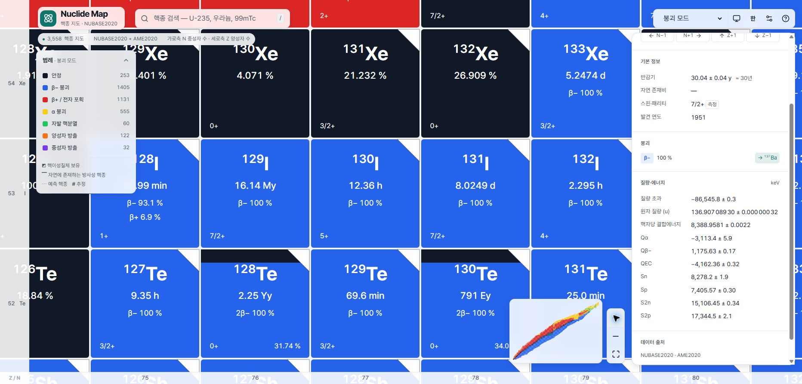

# 2단계 — 차트 사용성과 업무 시나리오

검증일: 2026-10-02. [1단계](01-data-science.md)의 범위·니즈·SCI 이슈를 이어서 평가했다. 실제 사용자 실험이 아닌 코드 검토와 Chrome 직접 조작, 기존 E2E 테스트 결과다.

## TOP 5

| 심각도 | 관점 | 문제 | 근거 |
| --- | --- | --- | --- |
| 치명 | [교육][핵물리][방사화학] | SCI-01/02: 분기 목록에서 전체/부분집합과 EC 포함 여부를 읽기 어려움 | [확인됨: `ui-Li-11.txt`, `ui-F-18.txt`, 1단계] |
| 높음 | [교육][핵물리][핵의학] | SCI-05: 이성질체 검색 결과에 기저 상태 제목·수치가 함께 나타남 | [확인됨: `ui-Hf-178m2.txt`, `Hf178m2-detail.png`] |
| 높음 | [핵물리][핵의학] | UX-01: 없는 이성질체를 요청하면 기저 상태로 조용히 대체 | [확인됨: `search-forms.json`, `search.ts:185–186`] |
| 높음 | [교육][핵물리] | UX-02: 질량수 우선 m2 표기는 검색되지 않음 | [확인됨: `178m2Hf`, `¹⁷⁸ᵐ²Hf` 입력 기록] |
| 높음 | [방사화학][질량분석][핵물리] | UX-03: 값·불확도·출처·버전을 묶어 복사할 수 없음 | [확인됨: 시나리오 I, 실제 복사 결과는 URL뿐] |

근거 파일은 [evidence/](evidence/)에 있다. 연구자 태그의 높음은 해당 업무를 목표로 할 경우의 중요도다. 목표 사용자 순위가 미입력인 상태에서 모든 분야를 동일 가중치로 합산하지 않았다. 딸 상태 문제 SCI-04도 높음이며 A/D에서 이어 다룬다.

## 1. 첫인상 판정: 부분

N 가로·Z 세로, 원소·핵자 수 눈금, 범례, 검색과 확대 조작은 익숙한 핵종 지도 탐색에 맞는다. 다만 셀의 한 가지 대표 색과 우상단 삼각형은 **모든 붕괴 분기를 나타내는 표식이 아니다.** 설명 없이 Karlsruhe 방식으로 읽거나, 이성질체 검색 후 패널 첫 반감기만 읽으면 잘못 해석할 수 있다. [확인됨: 화면, `colorModes.ts`, `InfoPanel.tsx`; 추정: 설명 없이 읽는 실제 사용자의 오류율은 미측정]

| 항목 | 판정·직접 근거 | 업무상 의미 |
| --- | --- | --- |
| 축·눈금 | N 가로/Z 세로, 숫자와 원소기호, 선택 눈금 강조 확인. [메인](evidence/main.png), [Sn 행](evidence/Sn-row-final.png) | [교육][핵물리] 관례와 일치 |
| 확대별 정보 | 배율 32/64/128 경계의 LOD, 큰 셀의 핵종명·반감기/존재비·붕괴·Jπ 확인. [코드 `lod.ts`], [큰 셀](evidence/cell-zoom-large.png) | [교육] 큰 지도와 상세 조회 역할 분담은 타당. 셀은 불확도를 생략하므로 수치 인용은 패널에서 해야 함 |
| 붕괴 색 | 밝은 테마 안정 검정 계열, β− 파랑, β+/EC 빨강, α 노랑. 어두운 테마 안정은 흰색 계열. IT는 회색 계열. [코드 `colorModes.ts`] | 기본 색은 대체로 익숙하나 테마·IT 차이를 범례로 확인해야 함. 모든 Karlsruhe 관례와 동일하다는 판정은 하지 않음 |
| 다중 붕괴 표식 | 대표 모드 한 색을 사용. 우상단 밝은 삼각형은 **이성질체 보유**. 5% 기준의 다중 붕괴 색 분할은 없음. [큰 셀 및 범례], [`primaryCategory`] | [교육][핵물리] UX-04. 검증 원문의 Karlsruhe 관례와 다른 점을 명시해야 함. 흰 삼각형을 IT 분기 비율로 읽으면 안 됨 |
| 반감기·결합에너지 색 | 색 모드 선택 UI·범례와 대응 코드 존재. [스냅샷, `colorModes.ts`] | 수치 색 척도 전 구간의 시각적 식별 성능은 이번에 측정하지 않음 |
| 확대·이동·주변 조회 | +/−, 전체 보기, N±1/Z±1, 원소 행 검색 제공. 확대 버튼 직접 사용, 검색으로 행 이동 확인 | [교육] 기본 이동 가능. 다핵종 고정 비교표는 없음 |
| 검색 | `¹³⁷Cs`, `137Cs`, `Cs137`, `cs-137`, `세슘-137`, `99mTc` 성공. m2 표기 두 형식 실패. [search-forms.json](evidence/search-forms.json) | 대소문자·한글은 편리함. 임의 오타 교정 전반은 확인 불가. 없는 m 상태 대체는 UX-01 |
| 보조선 | 마법수 Z=2,8,20,28,50,82 및 N=2,8,20,28,50,82,126, N=Z 선 코드 확인. N=82 검색 성공 | 같은 A 검색/선, 물리적으로 정의한 드립라인 표시 없음. 미관측 경계선을 드립라인으로 해석하면 안 됨 |
| hover·상세 | 반감기·불확도·대표 붕괴 툴팁, 클릭 상세 확인. 아래 E2E PNG도 보존 | 비교를 위해 패널을 계속 바꾸어야 하며 선택값 여러 개를 나란히 고정하지 못함 |
| 색각·접근성 | 문자·범례·선 종류·기호를 함께 사용. 기존 접근성/가독성 테스트 실행 | 색각 이상 사용자 대상 테스트·전 색상 대비 측정은 **확인 불가**. 접근성 전체 준수를 보증하지 않음 |

Karlsruhe의 세부 5% 분할 규칙은 사용자 제공 검증 기준과의 대조다. 이번에 공식 유료 차트의 현행 셀을 직접 대조하지 못했으므로 “Karlsruhe 원본 완전 재현 실패”를 수치로 채점하지 않았다. 비교 범위는 [3단계](03-verdict.md)에 명시했다.

### 화면 자료

| 요구 자료 | 보존 증거·해석 범위 |
| --- | --- |
| 메인 | [main.png](evidence/main.png) |
| 셀 확대 | [중간 배율](evidence/cell-zoom.png), [큰 셀](evidence/cell-zoom-large.png). 확대 단계와 셀 기호 확인용 |
| hover | [e2e-hover-desktop.png](evidence/e2e-hover-desktop.png), [e2e-hover-mobile.png](evidence/e2e-hover-mobile.png). **둘 다 테스트가 viewport를 390×844로 설정한 결과**이며 실제 휴대전화 실험이 아님 |
| 상세 패널 | [Cs-137](evidence/Cs137-detail.png), [Hf-178m2](evidence/Hf178m2-detail.png), [Li-11](evidence/Li-11-detail.png), [F-18](evidence/F-18-detail.png), [Pb-208](evidence/Pb-208-detail.png) |
| 검색 | [search-Cs137.png](evidence/search-Cs137.png), [입력별 결과](evidence/search-forms.json) |
| 붕괴 사슬 | [단계별 DOM 기록](evidence/scenario-D-chain.json), [수동 도달한 Pb-206](evidence/chain-Pb206-end.png). 앱에는 전체 사슬 화면이 없어 그 화면을 캡처한 것은 아님 |

## 2. 시나리오 결과표

조작 수는 **검색 문자열 전체 입력 1 + Enter 선택 1 + 버튼 클릭 각각 1**로 센다. 개별 키 입력 수, 포커스 이동, 읽기·스크롤, 테스트 도구의 스냅샷, 오류 후 자동화 재시도는 제외했다. 따라서 인간의 전체 클릭 수나 소요 시간이 아니라 **실제로 실행한 주요 동작 수**다. 서로 다른 세션 상태에서 수집한 조회를 묶은 경우 그렇게 명시했다. 최단 경로라고 주장하지 않는다.

| ID | 결과 | 확인된 조작 수 | 핵심 문제 |
| --- | --- | --- | --- |
| A | 부분 | Cs 검색 2 → Ba 버튼 1 → m 영역 펼침 1, 총 4 | 기본값 조회 가능. 딸 상태별 feeding과 662 keV γ 귀속은 미제공 |
| B | 부분 | K/Te 행 검색 4 + K-40/Te-128/Te-130 개별 검색 6, 조회 합계 10 | 자연 방사성 분류 가능. 전체 비교표 없음, 색·β 표기의 한계 |
| C | 부분 | Sn 행·Sn-100·Sn-132·Sn-138 각각 2, 조회 합계 8 | 마법수·# 확인 가능. 연속 전 핵종 비교나 드립라인 판정은 수행하지 않음 |
| D | 부분 | U-238 검색 2 + 딸 링크 14 = 16 | Pb-206까지 수동 도달. Pa-234m·모든 분기·전체 사슬 요약 미충족 |
| E | 부분 | Pb-204/206/207/208 개별 검색 각 2 = 8 | 원자질량·존재비 가능. 자연 변동 안내·질량차 계산/병렬 비교 없음 |
| F | 실패·범위 밖 | Co-60 직접 검색 2만 실시 | γ 에너지 역검색은 기능 자체가 없음. 역검색 성공의 2단계로 세지 않음 |
| G | 실패·범위 밖 | Co-59 직접 검색 2 | 반응·단면적 데이터 없음 |
| H | 부분 | A=87 입력 1(결과 없음) + Rb/Sr 개별 검색 4 = 5 | 두 원자질량 조회는 가능. 동중원소 검색/질량차 표시 없음 |
| I | 실패(요구된 묶음 복사 기준) | Cs 검색 2 + 링크 복사 1 = 3 | 값·불확도·출처·버전이 복사문에 포함되지 않음 |

위 결과는 각 시나리오의 **전체 성공 조건** 기준이다. F/G는 명시된 v1 범위 밖이므로 교육용 지도 자체의 실패 점수로 합산하지 않는다. 감마분광/원자로를 주 사용자로 정하면 해당 업무 적합성은 부족하다. 목표 사용자 순위는 아직 확인 불가다.

## 3. 시나리오별 상세

### A — ¹³⁷Cs 기본 조회

- 가능 여부: T½ `30.04 ± 0.04 y`, β−100%, Ba 링크와 Ba-137m의 존재까지 조회 가능. [확인됨: `ui-Cs-137.txt`, `ui-Ba-137-from-Cs.txt`, `ui-Ba-137m.txt`]
- 경로: 검색 입력 → Enter → `→137Ba` → `137mBa` 펼침. 처음 클릭한 딸 패널은 안정 기저 상태다. [4조작 연속 기록](evidence/scenario-A-path.json)
- 부족/혼동: SCI-04. 100%가 Ba 기저 상태로 직접 가는 확률은 아니다. 분기 feeding 확률과 γ 방출확률도 다르다. 직접 조회 CSV는 1단계 골든 표 참조.
- 개선: 링크가 가리키는 것은 “딸 원소/질량수, 상태 합계”임을 명시하고 확인 가능한 m 상태를 연결. 방출 데이터가 없으면 외부 평가 DB로 연결.
- 결과: **부분** [교육][감마분광][방사화학].

### B — K·Te 원소 내 비교

- 가능 여부: K/Te 입력으로 행 이동, K-40 및 Te-128/130 개별 조회 성공. [확인됨: `row-K.txt`, `row-Te.txt`, 각 `ui-*.txt`]
- 확인한 값: K-40은 1.248 Gy/0.0117%, Te-128은 2.25 Yy/31.74%, Te-130은 791 Ey/34.08%로 표시. 모두 유한 T½가 있고 자연 존재비도 제공한다. Te 두 핵종에는 `2β−`가 있다.
- 부족/혼동: “자연에 존재”와 “안정”을 같은 뜻으로 처리하지는 않는다. 다만 대표 색으로는 보통 β−와 2β−를 구별할 수 없고, EC 포함 β+ 표기는 SCI-02다.
- 개선: 안정/자연 존재/방사성의 독립 속성 설명, 같은 원소의 기본값 비교 보기. 실사용자 해석 정확도는 별도 측정 필요.
- 결과: **부분**. 분류 확인이라는 핵심은 통과했으며 표현·비교의 제약을 남겼다. [교육][질량분석]

### C — Sn 사슬과 마법수

- 가능 여부: Sn 행, Sn-100(Z=N=50), Sn-132(Z=50,N=82), 추가 경계 사례 Sn-138을 조회했다. [확인됨: `Sn-row-final.png`, `scenario-panels.json`]
- 확인: Sn-100의 추정 여기 에너지, Sn-138 질량·Q의 `#`가 보인다. Sn-132 기본값은 측정 표기로 구별된다. 마법수 선/눈금 확인.
- 부족/혼동: 100~132 사이 모든 핵종을 연속 드래그하여 개별 검증한 것은 아니다. #를 원소 전체의 불확실성으로 일반화하면 안 된다. 미관측 칸과 입자 드립라인은 다른 개념이다.
- 개선: # 필드별 정의 접근, 원소 행 비교·선택 상태 유지. Sn-138 지연입자 표기는 SCI-01/03에 해당.
- 결과: **부분** [교육][핵물리].

### D — ²³⁸U → ²⁰⁶Pb

실행 경로는 `238U → 234Th → 234Pa → 234U → 230Th → 226Ra → 222Rn → 218Po → 214Pb → 214Bi → 214Po → 210Pb → 210Bi → 210Po → 206Pb`다. 2회 검색 동작 뒤 14번 딸 링크를 눌렀다. [확인됨: `scenario-D-chain.json`의 step 2~16]

- 가능 여부: 대표 경로의 핵종 좌표를 따라갈 수 있다. Po-218 패널에 Pb-214/At-218, Bi-214 패널에 Po-214/Tl-210/Pb-210 링크·비율이 나타난다.
- 부족/혼동: Th-234에서 Pa-234의 기저 패널로 간다. 이성질체를 포함한 **실제 상태별 전체 사슬을 검증한 경로는 아니다**. 모든 가지를 끝까지 탐색하지 않았다. 지도 화살표는 최대 5개·비율 임계값을 적용하므로 전체 분기망과 같지 않다(`overlay.ts`).
- 종점: Pb-206은 `안정 (>2.5 Zy)`이면서 미관측 허용 α? 링크도 있다. 자동 사슬 계산·종결·순환 검사 기능이 없어 해당 알고리즘의 정확성은 평가할 대상이 없다. 안정 종점 뒤의 `?`를 실제 계속 붕괴하는 경로로 읽는 위험은 SCI-03이다.
- 개선: 먼저 딸 상태/관측 여부 의미를 고친 뒤 사슬 보기 필요성을 결정한다. 전체 사슬 기능 부재와 잘못된 링크 의미를 별개로 관리.
- 결과: **부분** [교육][방사화학].

### E — Pb 원자질량·존재비

- 가능 여부: 네 핵종의 `원자 질량 (u)` 라벨과 불확도, 존재비 조회 성공. [확인됨: 각 `ui-Pb-*.txt`, `ui-golden-panels.json`]
- 부족/혼동: 단일 기준값±불확도를 모든 시료의 조성 범위로 사용할 수 없다. CIAAW 자연 변동 구간과는 다른 양이다(1단계 골든 표). 질량차는 사용자가 별도 기록·계산해야 한다.
- 개선: 평가 기준값임을 알리는 문구와 CIAAW 출처, 선택 핵종 비교·차이 표시. 시료 조성 측정값을 대신한다고 주장하지 않기.
- 결과: **부분** [질량분석].

### F — 1173·1332 keV 피크 역검색

- 가능 여부: 에너지 역검색 UI·데이터가 없다. 확인 목적으로 Co-60을 직접 검색하여 `5.2714 ± 0.0006 y`와 β−를 보았으나 두 γ선 목록은 없다. [확인됨: `ui-Co-60.txt`, 데이터 스키마, 검색 코드]
- 부족/혼동: Co-60m 여기 에너지나 Qβ−를 γ선 목록으로 대신 읽으면 안 된다. 이 평가에서는 제시된 두 피크의 실제 에너지/세기 평가값을 새로 검증하지 않았다.
- 개선: 현재 범위에서는 미제공 범위를 알리고 평가 방출 DB로 연결. 역검색 구현은 사용자군 확장 결정 후 진행.
- 결과: **실패·범위 밖** [감마분광].

### G — ⁵⁹Co(n,γ)⁶⁰Co

- 가능 여부: Co-59와 이웃 핵종은 찾을 수 있으나 반응 채널·평가 라이브러리·입사 에너지·단면적이 없다. [확인됨: `ui-Co-59.txt`, 스키마]
- 부족/혼동: N+1 이동은 중성자 포획 반응의 확률이나 생성 경로를 제공하는 기능이 아니다.
- 개선: 반응 데이터가 목표 범위에 들어올 때 ENDF 계열의 에너지·온도·라이브러리를 함께 설계. 현재는 KAERI/NNDC 등으로 연결하는 방법을 우선 검토.
- 결과: **실패·범위 밖** [원자로].

### H — A=87 동중원소 간섭

- 가능 여부: `A=87`은 결과 없음. Rb-87/Sr-87 개별 조회는 성공한다. [확인됨: `search-forms.json`, `ui-Rb-87.txt`, `ui-Sr-87.txt`]
- 표시값: `86.909180529 ± 0.000000006 u`, `86.9088774945 ± 0.0000000055 u`(화면의 자릿수 구분 공백만 생략).
- 두 표시 중심값의 차이는 **0.0003030345 u**다. 이는 검증자가 별도로 뺀 값이며 앱 계산 결과가 아니다. 오차 상관을 조사하지 않아 질량차 불확도는 산출하지 않았다.
- 부족/혼동: 원자질량이므로 이온 전하·분자 간섭·측정 장치 분해능을 함께 고려하는 업무 전체를 끝낼 수 없다.
- 개선: A 검색 및 선택 핵종 비교. 이온·분자 분석 기능은 별도 범위.
- 결과: **부분** [질량분석].

### I — 출처 포함 인용

- 가능 여부: Cs 조회 후 “링크 복사”를 눌렀다. 복사문은 `?view=…&nuclide=Cs-137`를 포함한 로컬 URL이다. [확인됨: `scenario-I-copy.txt`, `scenario-I-copied-url.txt`]
- 부족/혼동: 값·불확도·NUBASE2020·평가/조회일을 함께 담지 않는다. 도움말 DOI와 패널 출처는 존재하므로 사람이 따로 옮겨 적을 수는 있다. “인용 자체가 불가능”하다는 판정은 아니다.
- 개선: 링크 복사와 별도로 상태·필드·값·단위·불확도·출처·버전·조회일의 인용문/TSV 복사 제공.
- 결과: **실패(요구된 묶음 복사 기준)** [방사화학][핵물리][질량분석].

## 4. 사용성 이슈 카드

### UX-01 [높음][핵물리][핵의학] 존재하지 않는 m 상태를 기저 상태로 대체

- 근거: [확인됨: `search-forms.json`의 `Tc-99m2` → `99Tc · 211.1 ky`; `src/data/search.ts:185–186`].
- 문제: 요청한 상태가 없어도 검색 결과가 다른 상태로 바뀐다.
- 왜 문제인지: 검색 실패를 알아차리지 못한 채 기저 값을 선택 상태의 값으로 사용할 수 있다.
- 영향: 이성질체 반감기·상태 식별 및 인용.
- 개선: “요청한 상태 없음”을 표시하고 기저 상태는 별도 제안으로만 제공한다.

### UX-02 [높음][교육][핵물리] 통용되는 질량수 우선 m2 표기 검색 실패

- 근거: [확인됨: `178m2Hf`, `¹⁷⁸ᵐ²Hf` 결과 없음; `Hf-178m2`는 성공; `search.ts:128–134`].
- 문제: 같은 물리적 상태를 가리키는 입력 형식의 지원이 일관되지 않다.
- 왜 문제인지: 데이터가 없다고 오인하거나 표기를 바꾸는 데 시간을 쓴다.
- 영향: 다중 이성질체 탐색.
- 개선: 원소 우선·질량수 우선 m/m1/m2와 위첨자를 같은 상태 키로 정규화한다.

### UX-03 [높음][방사화학][핵물리][질량분석] 인용할 값과 출처를 함께 가져오지 못함

- 근거: [확인됨: 시나리오 I].
- 문제: 공유 URL과 데이터 인용이 구별되어 있지 않다.
- 왜 문제인지: 여러 값을 수동으로 옮기면 버전·상태·불확도를 빠뜨릴 수 있다.
- 영향: 연구노트·교육자료에 재현 가능한 수치 기록.
- 개선: 인용 복사와 링크 복사를 분리하고 각 필드의 근거를 함께 제공한다.

### UX-04 [중간][교육][핵물리] 대표 색·흰 삼각형의 의미를 관례로 추측하기 쉬움

- 근거: [확인됨: 큰 셀 캡처, 범례의 “핵이성질체 보유”, `primaryCategory`].
- 문제: 대표 붕괴 단색 및 이성질체 삼각형이 다중 붕괴의 색 분할처럼 보일 여지가 있다.
- 왜 문제인지: 확대 전에는 소분기 존재를 확인할 수 없으며 삼각형 면적은 분기비가 아니다.
- 영향: 지도만 보고 분기 유무·비율을 판단하는 교육/탐색. 실제 오독률은 [확인 불가: 사용자 실험 필요].
- 개선: 대표 색임을 범례에 명시하고 이성질체 기호의 식별성을 검증한다. 색 면적으로 실제 분율을 표시하려면 전체/부분 경로부터 정리해야 한다.

### QA-01 [중간][교육][핵물리] 지연 글꼴 로드 시나리오가 5개 프로젝트에서 실패

- 근거: [확인됨: `e2e-final.log`, `e2e-font-network.json`, `e2e-failures/`, `e2e/rulers.spec.ts:128–150`].
- 문제: 글꼴 해제 후 `--ruler-w`가 이전과 달라야 한다는 assertion이 시간 초과했다. Firefox 62px, 나머지 64px가 유지됐다.
- 왜 문제인지: 기존 테스트 묶음의 통과 조건이 충족되지 않아 이 경우의 레이아웃 갱신을 보증할 수 없다.
- 영향: 늦게 도착한 글꼴의 눈금 폭·클릭 여백. **실제 눈금 겹침이나 오선택이 발생했다는 증거로 확대 해석하지 않는다.**
- 원인 상태: 각 실행에 woff2 요청 14개, 모두 HTTP 200. 앱은 Pretendard를 import하며 `document.fonts.ready`/`loadingdone`에서 캐시 초기화·눈금 재계산을 호출한다. 따라서 “글꼴 파일 없음”, “이벤트 처리 코드 없음”은 틀린 설명이다. 측정 시점, 실제 선택 글꼴, 올림 후 동일 폭, 이벤트 경로를 구별할 계측은 미수행이다.
- 개선: 추후 별도 권한의 수정 작업에서 폭 변화가 아닌 재측정·접근 가능한 여백이라는 실제 요구 조건을 검증하도록 테스트 전제와 구현을 함께 조사한다. 이번에는 코드/테스트를 수정하지 않았다.

## 다음 단계 인계 요약

1. 축·기본 검색·상세·마법수는 확인했으나 전체 첫인상 판정은 부분이다.
2. 시나리오 A~E/H는 부분, F/G는 범위 밖 실패, I는 묶음 인용 복사 실패다.
3. SCI-01/02 의미 오류와 SCI-04/05 상태 문맥이 업무 판정을 제한한다.
4. UX-01 없는 상태의 기저 대체, UX-02 질량수 우선 m2 검색 실패는 재현됐다.
5. 대표 색·이성질체 삼각형은 전체 붕괴 분율 표시가 아니다.
6. U→Pb의 16조작 기록은 수동 대표 경로이며 모든 상태·분기 검증이 아니다.
7. E2E는 98 통과/12 건너뜀/5 실패, QA-01 근본 원인은 미확정이다.
8. 실제 사용자 시간·오독률, 실기기 사용성, 경쟁 도구 대비 속도는 미측정이다.
9. 목표 사용자 순위 미입력 및 v1 범위 밖 기능은 3단계에서도 별도로 다룬다.
